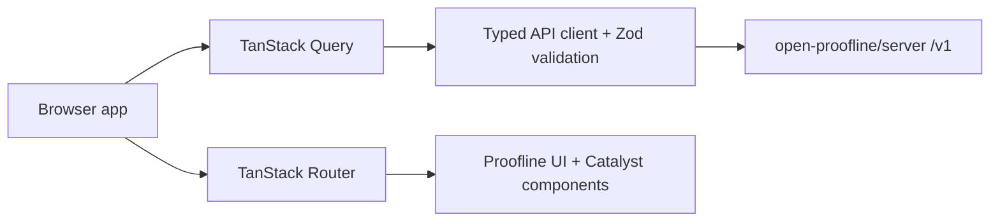

# Architecture

The web client is a Vite React TypeScript app.

## Boundaries

- The app handles account login, public registration, email verification, and
  incident metadata review.
- The live API client supports explicit bearer-token and browser-cookie auth
  modes. Cookie mode uses server-managed HttpOnly cookies, in-memory CSRF
  tokens, and `credentials: "include"` only for cookie-authenticated requests.
- The app does not record media.
- The app does not decrypt chunks or unwrap wrapped keys.
- The app does not export playable media.
- The app does not contact emergency services.

`open-proofline/server` remains the source of truth for backend routes,
authorization, encrypted bundle behavior, and security headers.

## Source Layout

- `src/api/`: API client, Zod schemas, and safe error handling
- `src/auth/`: session state and auth hooks
- `src/routes/`: TanStack route definitions
- `src/components/proofline/`: app-specific components
- `src/components/catalyst/`: Catalyst component source used by this app
- `tests/e2e/`: Playwright smoke tests
