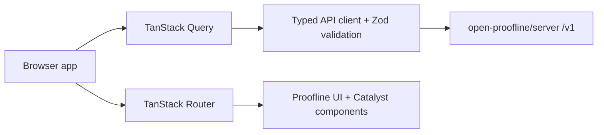

# Architecture

The web client is a Vite React TypeScript app.

## Boundaries

- The app handles account login, public registration, email verification,
  account profile/password management, and incident metadata review.
- The app does not implement account second-factor setup, challenge,
  verification, or recovery UI yet; current second-factor route support remains
  a server-side fact to verify against `open-proofline/server`.
- The live API client supports explicit bearer-token and browser-cookie auth
  modes. Cookie mode uses server-managed HttpOnly cookies, in-memory CSRF
  tokens, and `credentials: "include"` only for cookie-authenticated requests.
- The app does not record media.
- The app does not decrypt chunks or unwrap wrapped keys.
- The app does not export playable media.
- The app does not contact emergency services.

`open-proofline/server` remains the source of truth for backend routes,
authorization, encrypted bundle behavior, and security headers.

`open-proofline/website` remains the source of truth for Proofline public
governance, cooperative/public-good posture, public voice, and reusable README
structure. Keep those project-level claims linked instead of duplicating them
in architecture docs.

## Product Design Boundary

[End-user web-client design](end-user-web-client-design.md) defines the product
direction for translating technical account, incident, contact, sharing,
wrapped-key, viewer-link, and future capture concepts into normal user
workflows. It does not change the current route tree or API client.

Future UI work should lead with human status, next actions, access state,
upload/location freshness, and safety boundaries. Raw IDs, stream and chunk
details, sharing-grant fields, wrapped-key details, route names, and
cryptographic terms belong in advanced, security, API, or developer contexts
unless a user-facing flow explicitly needs them.

## Source Layout

- `src/api/`: API client, Zod schemas, and safe error handling
- `src/auth/`: session state and auth hooks
- `src/routes/`: TanStack route definitions
- `src/components/proofline/`: app-specific components
- `src/components/catalyst/`: Catalyst component source used by this app
- `tests/e2e/`: Playwright smoke tests
